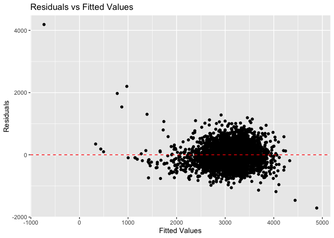

HW6
================
Chrissy Chen
2023-11-28

``` r
library(tidyverse)
```

    ## ── Attaching core tidyverse packages ──────────────────────── tidyverse 2.0.0 ──
    ## ✔ dplyr     1.1.3     ✔ readr     2.1.4
    ## ✔ forcats   1.0.0     ✔ stringr   1.5.0
    ## ✔ ggplot2   3.4.3     ✔ tibble    3.2.1
    ## ✔ lubridate 1.9.2     ✔ tidyr     1.3.0
    ## ✔ purrr     1.0.2     
    ## ── Conflicts ────────────────────────────────────────── tidyverse_conflicts() ──
    ## ✖ dplyr::filter() masks stats::filter()
    ## ✖ dplyr::lag()    masks stats::lag()
    ## ℹ Use the conflicted package (<http://conflicted.r-lib.org/>) to force all conflicts to become errors

``` r
library(boot)
library(broom)
library(readr)
library(modelr)
```

    ## 
    ## Attaching package: 'modelr'
    ## 
    ## The following object is masked from 'package:broom':
    ## 
    ##     bootstrap

``` r
library(mgcv)
```

    ## Loading required package: nlme
    ## 
    ## Attaching package: 'nlme'
    ## 
    ## The following object is masked from 'package:dplyr':
    ## 
    ##     collapse
    ## 
    ## This is mgcv 1.9-0. For overview type 'help("mgcv-package")'.

``` r
library(dplyr)
```

#### Problem 2

``` r
weather_df = 
  rnoaa::meteo_pull_monitors(
    c("USW00094728"),
    var = c("PRCP", "TMIN", "TMAX"), 
    date_min = "2022-01-01",
    date_max = "2022-12-31") |>
  mutate(
    name = recode(id, USW00094728 = "CentralPark_NY"),
    tmin = tmin / 10,
    tmax = tmax / 10) |>
  select(name, id, everything())
```

    ## using cached file: /Users/chensixuan/Library/Caches/org.R-project.R/R/rnoaa/noaa_ghcnd/USW00094728.dly

    ## date created (size, mb): 2023-11-27 23:26:31.860671 (8.544)

    ## file min/max dates: 1869-01-01 / 2023-11-30

``` r
# lm_weather = lm(tmax ~ tmin + prcp, data = weather_df)
# 
# bootstrap_function = function(data, indices) {
#   sampled_data = data[indices, ]
#   lm_weather = lm(tmax ~ tmin + prcp, data = sampled_data)
#   
#   rsquared = glance(lm_weather)$r.squared
#   coef_product = log(tidy(lm_weather)$estimate[2] * tidy(lm_weather)$estimate[3])
#   
#   return(c(rsquared, coef_product))
# }
# 
# set.seed(123)
# 
# bootstrap_results <- boot(data = weather_df, statistic = bootstrap_function, R = 5000)
# 
# par(mfrow = c(1, 2))  # Set up a 1x2 grid for side-by-side plots
# hist(bootstrap_results$t[, 1], main = "Distribution of R-squared", col = "lightblue")
# hist(bootstrap_results$t[, 2], main = "Distribution of log(beta1 * beta2)", col = "lightgreen")
# par(mfrow = c(1, 1))  # Reset the plot layout
# 
# # Identify the 2.5% and 97.5% quantiles
# quantiles <- quantile(bootstrap_results$t, c(0.025, 0.975), na.rm = TRUE)
# print(quantiles)
```

``` r
set.seed(1)
boot_sample = function(df) {
  sample_frac(df, replace = TRUE)
}

boot_straps = 
  tibble(strap_number = 1:5000) |> 
  mutate(
    strap_sample = map(strap_number, \(i) boot_sample(df = weather_df))
  )

bootstrap_results_betas = 
  boot_straps |> 
  mutate(
    models = map(strap_sample, \(df) lm(tmax ~ tmin + prcp, data = df) ),
    results = map(models, broom::tidy)) |> 
  select(-strap_sample, -models) |> 
  unnest(results) |>
  select(strap_number, term, estimate) |>
  pivot_wider(names_from = term, values_from = estimate) |>
  mutate(coef = log(tmin * prcp))

quantile_betas = 
  bootstrap_results_betas |>
  na.omit() |>
  summarize(
    ci_lower = quantile(coef, 0.025), 
    ci_upper = quantile(coef, 0.975))
quantile_betas
```

    ## # A tibble: 1 × 2
    ##   ci_lower ci_upper
    ##      <dbl>    <dbl>
    ## 1    -8.98    -4.60

``` r
bootstrap_results_rsq = 
  boot_straps |> 
  mutate(
    models = map(strap_sample, \(df) lm(tmax ~ tmin + prcp, data = df) ),
    results = map(models, broom::glance)) |>
  select(-strap_sample, -models) |> 
  unnest(results) |>
  select(strap_number, r.squared) 

quantile_rsq = 
  bootstrap_results_rsq |>
  summarize(
    ci_lower = quantile(r.squared, 0.025), 
    ci_upper = quantile(r.squared, 0.975))
quantile_rsq
```

    ## # A tibble: 1 × 2
    ##   ci_lower ci_upper
    ##      <dbl>    <dbl>
    ## 1    0.889    0.941

``` r
par(mfrow = c(1, 2))
hist(bootstrap_results_rsq$r.squared, main = "Distribution of rsquared", col = "lightgreen")
hist(bootstrap_results_betas$coef, main = "Distribution of log(beta1 * beta2)", col = "lightblue")
```

<!-- -->

``` r
par(mfrow = c(1, 1))
```

#### Problem 3

``` r
birthweight = 
  read_csv("birthweight.csv")
```

    ## Rows: 4342 Columns: 20
    ## ── Column specification ────────────────────────────────────────────────────────
    ## Delimiter: ","
    ## dbl (20): babysex, bhead, blength, bwt, delwt, fincome, frace, gaweeks, malf...
    ## 
    ## ℹ Use `spec()` to retrieve the full column specification for this data.
    ## ℹ Specify the column types or set `show_col_types = FALSE` to quiet this message.

``` r
model_1 = lm(bwt ~ delwt + wtgain + blength, data = birthweight)
prediction_1 = add_predictions(birthweight, model_1)
residual_1 = add_residuals(prediction_1, model_1)
ggplot(residual_1,aes(x = pred, y = resid)) +
  geom_point() +
  geom_hline(yintercept = 0, linetype = "dashed", color = "red") +
  labs(title = "Residuals vs Fitted Values", x = "Fitted Values", y = "Residuals")
```

<!-- -->

``` r
model_lg = lm(bwt ~ blength + gaweeks, data = birthweight)
prediction_lg = add_predictions(birthweight, model_lg)
residual_lg = add_residuals(prediction_lg, model_lg)
ggplot(residual_lg,aes(x = pred, y = resid)) +
  geom_point() +
  geom_hline(yintercept = 0, linetype = "dashed", color = "red") +
  labs(title = "Residuals vs Fitted Values", x = "Fitted Values", y = "Residuals")
```

<!-- -->

``` r
model_hls = lm(bwt ~ bhead * blength * babysex, data = birthweight)
prediction_hls = add_predictions(birthweight, model_hls)
residual_hls = add_residuals(prediction_hls, model_hls)
ggplot(residual_hls,aes(x = pred, y = resid)) +
  geom_point() +
  geom_hline(yintercept = 0, linetype = "dashed", color = "red") +
  labs(title = "Residuals vs Fitted Values", x = "Fitted Values", y = "Residuals")
```

<!-- -->

``` r
cv_df = 
  crossv_mc(birthweight, 100) |>
  mutate(
    train = map(train, as_tibble),
    test = map(test, as_tibble)) |>
  mutate(
    model_1  = map(train, \(df) lm(bwt ~ delwt + wtgain + blength, data = birthweight)),
    model_lg  = map(train, \(df) lm(bwt ~ blength + gaweeks, data = birthweight)),
    model_hls  = map(train, \(df) lm(bwt ~ bhead * blength * babysex, data = birthweight))) |> 
  mutate(
    rmse_1 = map2_dbl(model_1, test, \(mod, df) rmse(model = mod, data = df)),
    rmse_lg = map2_dbl(model_lg, test, \(mod, df) rmse(model = mod, data = df)),
    rmse_hls = map2_dbl(model_hls, test, \(mod, df) rmse(model = mod, data = df))) |>
  select(starts_with("rmse")) |> 
  pivot_longer(
    everything(),
    names_to = "model", 
    values_to = "rmse",
    names_prefix = "rmse_") |> 
  mutate(model = fct_inorder(model)) |> 
  ggplot(aes(x = model, y = rmse)) + geom_violin()

cv_df
```

<!-- -->
